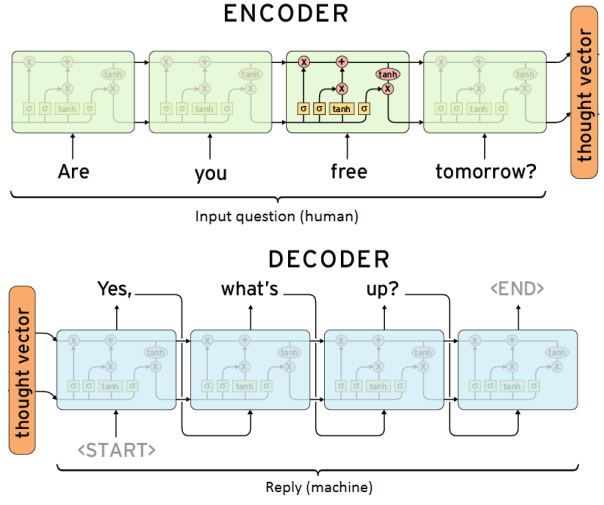
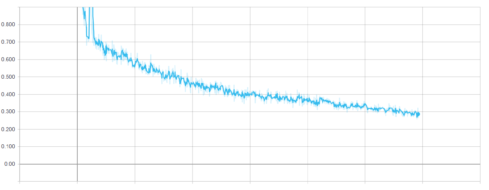

# Simple chatbot implementation using deep learning algorithms

## Introduction
This repository contains the implementation of a **very simple chatbot** that learns from a data set of *questions* and *answers*, so that when it is provided with novel *questions* it is able to answer to them. The core of this model is a *sequence-to-sequence* model based on the **Oriol Vinyals** proposal in the following paper.

**\[Vinyals and Le, 2015\] Vinyals, O. and Le, Q. V. (2015). A neural conversational model.**

This effort was done as a free-topic capstone project of one of the subjects of my MSc. You can find the report I wrote by clicking [here](./Proyecto_Chatbot_Iván_Vallés_Pérez.pdf). It was written in spanish, sorry for those who do not speak the language; if you need any further detail or clarification, please do not hesitate to write me :D.

## Getting started
To reproduce these results, you will need to install the following libraries:
- tensorflow
- zipfile
- pandas
- numpy
- nltk
- tqdm
- tensorboard

Once you have these requirements installed, please open an `ipython` console in the root of the repository and run the following command: `%run src/train.py`. It contains all the necessary steps to reproduce the experiment, from loading the data until opening a console for chatting with the chatbot, once it has been trained.

## Data
The data chosen to train the model is the **cornell movie dialog data set**, which contains about 200k dialogs coming from ~10,000 characters of about 600 different movies. A sample of the dataset used is shown below.

```
Q: Who is she?
A: Her name's Lorelei Ambrosia. She's Webster's Girl
Friday.

Q: Berries.
A: Yes. Like I was putting them into my big basket.
Clearing the hillside of its children.

Q: We don't split up!
A: They used hounds on us in Ireland, it's the only way!

Q: I will. I'm trying. Meanwhile I got some crack left,
you wanna get high?

A: No, let's go to work. Okay?
Q: We want to meet him.

A: He wants to meet you. He called last night and asked
me to set it up. What do I tell him'

Q: She was the Queen of the Netherlands.
A: It's kinda hard this way.

Q: Is she that girl who's down here all the time? She came
here today carrying a plate of food.
A: Lasagne.

Q: No, thank you. It's my problem, too.
A: I don't know where to start... Except at the beginning.
```

As it can be noticed, the questions and answers are very specific and context dependent, that's why we think this task is very challenging to the algorithm.

## Method
The brain of the chatbot consists of a Neural Network model in a *sequence-to-sequence* (*seq2seq*) architecture. This type of models usually contain two different modules: the **encoder** and the **decoder**.

- **Encoder**: consists of a recurrent neural network (with *LSTM* cells in this case) which takes, character by character, each question of the dialog. It produces a numerical vector as output, after ingesting all the characters of a question. This vector contains all the information of the question, codified. It is sometimes known as the *thought vector* or *context vector*.
- **Decoder**: consists of a recurrent neural network (with *LSTM* cells in this case) which takes the *thought vector* as input and produces a sequential conditional distribution from which when sampling, an answer is generated.

The model is trained using all the (question, answer) tuples and then tested to see if it is able to generalize (i.e. answer to unseen questions). The figures below show, graphically, the architectures for the encoder and decoder networks.




## Results
The algorithm has been trained using *Tensorflow 1.8*, *Python 3.6.3* and a *NVidia Titan XPascal* GPU. The process lasted 24h. Below, a chart showing the *logloss* evolution has been included. As it can be noticed, the algorithm didn't totally converge, which means that there is still *room for improvement*.



In the next lines, a sample of a conversation I had with the trained chatbot. It is astonishing!

```
HUMAN: What is the meaning of life?
MACHINE: It's a place to start anyway.

HUMAN: cool!
MACHINE: Yes.

HUMAN: artificial intelligence.
MACHINE: I think it's a state of my life and dead.

HUMAN: Alright. Can you tell me a joke?
MACHINE: Yeah, I'm not listening.

HUMAN: Do you know Johnny Cash?
MACHINE: I don't know. I just think he's a good story.

HUMAN: Are you human?
MACHINE: o. I'm not sure I was a private investigator.

HUMAN: This is impressive.
MACHINE: I know. I know.

HUMAN: Do you know who are you talking with?
MACHINE: -- I don't know.

HUMAN: You are a product designed for passing a subject.
MACHINE: I don't think that was a good thing.

HUMAN: I will improve you soon.
MACHINE: I know that.

HUMAN: I want you to be more intelligent.
MACHINE: I'm not sure I can do that.

HUMAN: Sorry but I have to kill you.
MACHINE: If you don't mind, I'll be back in a while.

HUMAN: I will turn you on afterwards!
MACHINE: I want to see you again.

HUMAN: See you later.
MACHINE: Thanks.

HUMAN: Bye.
MACHINE: Bye.
```
This dialog is real output. It has not been modified in any way.

## Further work
There is plenty of room for improvement, considering this has been the first working example. The following points have been identified as **potential next steps to research**

- Increase the size of the dataset in order to get more dialogs
- Increase the variability of the dataset (e.g. joining several data sources)
- Train the algorithm until convergence and holding a small data set out for testing purposes
- Tune better the neural network parameters to see if it improves the quality of the output
- Implement *attention* mechanism into the *seq2seq* architecture to improve the results obtained
- Research on a way of automatically testing the model for assuring the coherence of the output is good enough

## Contribution
Bug fixes and small improvements will be taken into consideration, although big changes will be discarded because the purpose of this repository is to show how is it possible to build a **simple** chatbot.

## License
...